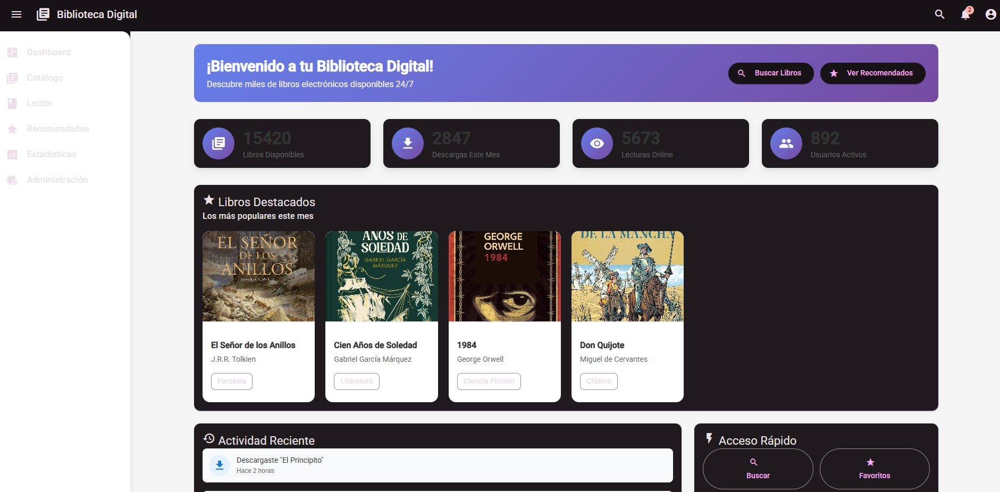

# Biblioteca Digital – Frontend



## Descripción

**Biblioteca Digital** es una plataforma web institucional moderna para la gestión, consulta y lectura de libros electrónicos, desarrollada en Angular standalone con Angular Material. Incluye autenticación, dashboard, catálogo, estadísticas, recomendaciones y más.

---

## Características principales
- Login moderno con loader y mensaje de bienvenida
- Dashboard con estadísticas y libros destacados
- Catálogo de libros con portadas reales
- Sidebar y layout responsive
- Accesibilidad y diseño profesional

---

## Demo rápido
- **Usuario:** `jenny@jenny.com`
- **Contraseña:** `123`

---

## Instalación y uso

1. Instala dependencias:
   ```bash
   npm install
   ```
2. Inicia el servidor de desarrollo:
   ```bash
   npm start
   ```
3. Abre en tu navegador:
   [http://localhost:4200](http://localhost:4200)

---

## Estructura de carpetas

```
frontend/
  biblioteca-digital/
    src/
      app/
        modules/
          login/
          dashboard/
          books/
          ...
        layouts/
          main-layout.component.ts
      public/
        assets/
          covers/
            lotr.jpg
            cien-anos.jpg
            1984.jpg
            don-quijote.jpg
    README.md
```

---

## Captura de pantalla


---

## Créditos
- Desarrollado con Angular 17+, Angular Material y mucho ❤️
- Diseño y UX por [Tu Nombre]

---

## Notas
- Para desarrollo y pruebas locales. Para producción, ajustar variables de entorno y seguridad.
